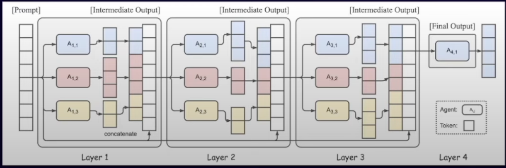
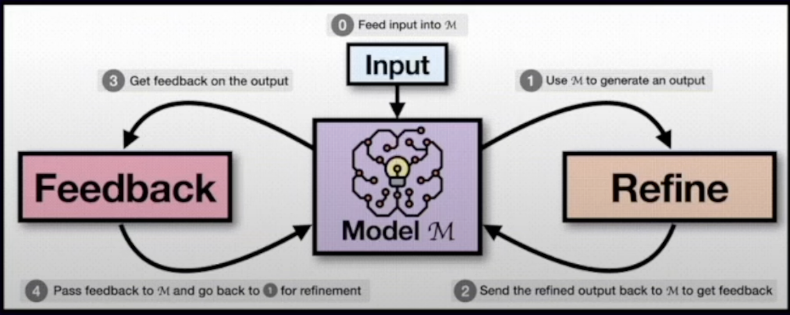

# 🤖 Mixture of Agents (MoA) - Predicción de Abandono de Clientes 🏦

## 🌟 Descripción del Proyecto

¡Bienvenido al proyecto Mixture of Agents (MoA) para la predicción de abandono de clientes! 🎉 Este proyecto combina técnicas avanzadas de aprendizaje automático con inteligencia artificial conversacional para proporcionar predicciones precisas y explicables sobre el abandono de clientes en el sector bancario.

## 🧠 ¿Qué es Mixture of Agents (MoA)?

Mixture of Agents (MoA) es un enfoque innovador en el aprendizaje automático que combina múltiples modelos o "agentes" para realizar predicciones. 🤝 Cada agente se especializa en diferentes aspectos del problema, y juntos forman un ensemble poderoso y flexible.

### 🔑 Características clave de MoA:

1. **Diversidad de Modelos** 🎭: Utiliza una variedad de algoritmos de aprendizaje automático, cada uno con sus fortalezas únicas.
2. **Ponderación Adaptativa** ⚖️: Ajusta dinámicamente la importancia de cada modelo basándose en su rendimiento.
3. **Robustez** 💪: Al combinar múltiples modelos, MoA es menos susceptible a errores individuales.
4. **Flexibilidad** 🐙: Puede adaptarse a diferentes tipos de datos y problemas.
5. **Interpretabilidad Mejorada** 🔍: Permite entender la contribución de cada modelo a la predicción final.

## 🚀 Funcionalidades

- **Predicción de Abandono** 📊: Utiliza MoA para predecir la probabilidad de que un cliente abandone el banco.
- **Interfaz de Usuario Intuitiva** 💻: Una aplicación Streamlit fácil de usar para ingresar datos de clientes y obtener predicciones.
- **Interpretación de IA** 🗣️: Utiliza un modelo de lenguaje grande (LLM) para proporcionar explicaciones en lenguaje natural de las predicciones.
- **Asistente Virtual** 🤖: Responde preguntas adicionales sobre las predicciones y los datos del cliente.

## 🛠️ Tecnologías Utilizadas

- **Python** 🐍: El lenguaje de programación principal.
- **Scikit-learn** 🧮: Para implementar y entrenar los modelos de aprendizaje automático.
- **Pandas & NumPy** 🐼: Para manipulación y análisis de datos.
- **Streamlit** 🌊: Para crear la interfaz de usuario web.
- **MLflow** 📦: Para el seguimiento de experimentos y la gestión de modelos.
- **Together AI** 🤝: Para integrar capacidades de LLM en el proyecto.

## 🏃‍♂️ Cómo Ejecutar el Proyecto

1. Clona el repositorio: 
   ```
   git clone https://github.com/tu-usuario/MoA-MixtureOfAgents-Agents-Project.git
   ```
2. Instala las dependencias:
   ```
   pip install -r requirements.txt
   ```
3. Ejecuta la aplicación Streamlit:
   ```
   streamlit run src/app.py
   ```

## 📈 Resultados y Rendimiento

El modelo MoA ha demostrado un rendimiento excepcional en la predicción de abandono de clientes, superando a los modelos individuales en términos de precisión y robustez. 🏆

## 🤝 Contribuciones

¡Las contribuciones son bienvenidas! Si tienes ideas para mejorar el proyecto o agregar nuevas funcionalidades, no dudes en abrir un issue o enviar un pull request. 👥

## 📜 Licencia

Este proyecto está bajo la licencia MIT. Consulta el archivo `LICENSE` para más detalles.

---

¡Gracias por tu interés en nuestro proyecto Mixture of Agents! 🙌 Si tienes alguna pregunta o comentario, no dudes en contactarnos. ¡Esperamos que encuentres este proyecto tan emocionante como nosotros! 🌟


Que es MoA?

Una nueva metodologia que aprovecha las fortalezas colectivas de multi-agente de Modelos de Lenguaje (LLMs). Hecha por Together Labs.

La imagen:




## ¿Cómo funciona?

MoA es un sistema de recomendación de lenguaje natural que utiliza un enfoque de multi-agente para mejorar la calidad de las recomendaciones. Los agentes son modelos de lenguaje que se entrenan en diferentes conjuntos de datos y se especializan en diferentes tareas. 
Cuando un usuario hace una consulta, los agentes trabajan juntos para proporcionar una respuesta precisa y relevante.

## ¿Por qué es importante?

MoA es importante porque aprovecha las fortalezas colectivas de los modelos de lenguaje para proporcionar recomendaciones más precisas y relevantes. 
Esto puede ayudar a mejorar la experiencia del usuario y aumentar la eficiencia de los sistemas de recomendación de lenguaje natural.

## Auto-refinamiento

MoA también incluye un mecanismo de auto-refinamiento que permite a los agentes mejorar continuamente su rendimiento a medida que interactúan con los usuarios y reciben retroalimentación.




## Limitaciones del Autorefinamiento

- Depende de las capacidades del modelo de lenguaje subyacente.
- Puede quedar atrapado en sesgos o errores iniciales.


## MoA como Evolucion:

- Aprovecha multiples modelos para superar estas limitaciones.
- Combina diversas perspectivas y capacidades

## Ventajas de MoA

- Aprovecha las fortalezas unicas de diferentes modelos de lenguaje.
- Mejora significativa en la calidad de las respuestas.
- Supera a modelos individuales en benchmarks de lenguaje natural.
- Supera las limitaciones del auto-refinamiento con un solo modelo.

## Concepto Clave - Colaboratividad:

- Los LLMs tienden a generar mejores respuestas cuando tienen accesos a salidas de otros modelos.
- Funciona incluso cuando las respuestas auxiliares son de menor calidad.
